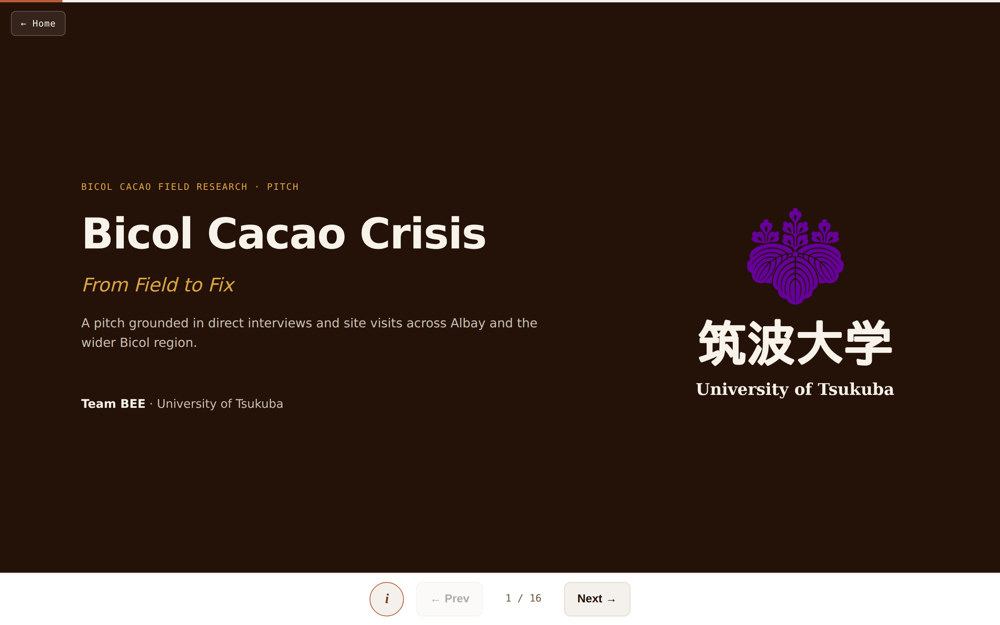
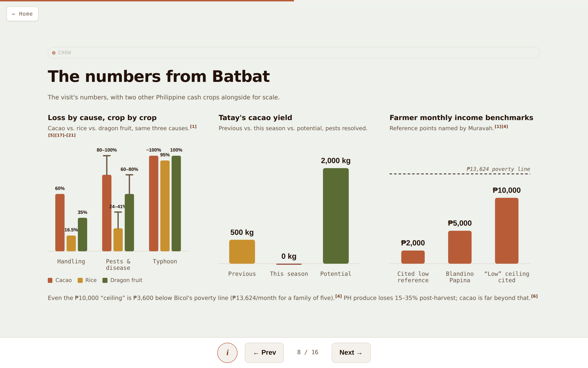
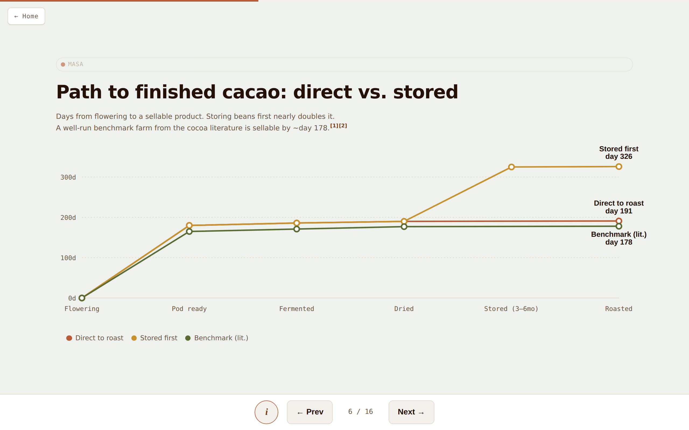
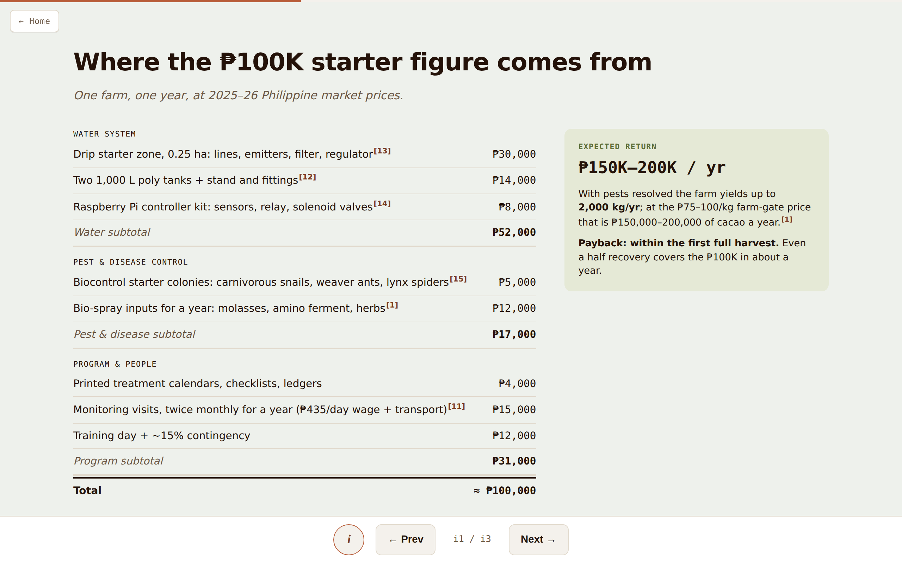
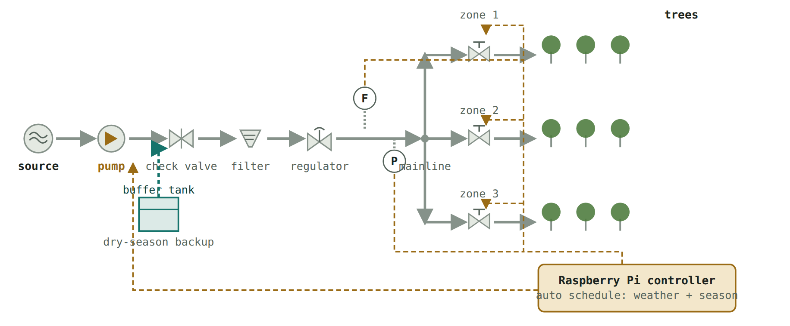
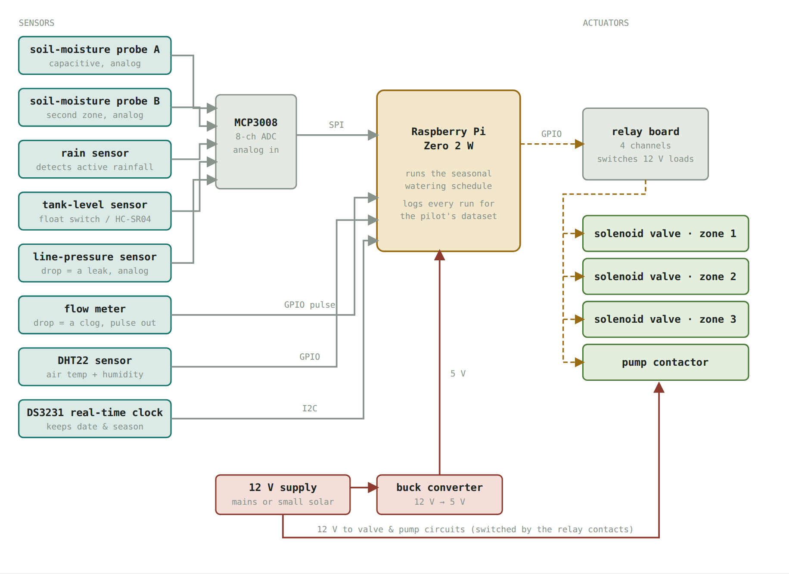
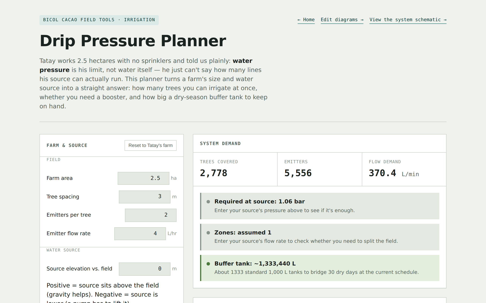

# Bicol Cacao Field Tools

**Decision tools, engineering schematics, and an interactive pitch for reviving smallholder cacao farming in Bicol, Philippines — built from primary field research.**

**Live site:** <https://REPLACE-WITH-YOUR-SITE.netlify.app>

Developed by **Team BEE · University of Tsukuba**, from interviews and site visits across Albay conducted in August 2026: the Muravah Foundation / Mayon Gold cacao NGO, a 2.5-hectare smallholder cacao farm in Batbat, a community cacao processing facility, and comparison visits to rice/dairy, bamboo, honey, and agrivoltaics operations.

---

## The problem

The farm at the center of this study historically produced ~500 kg of cacao per year. This season it produced approximately **zero** — pests and disease drive post-harvest losses of **80–100%** across the network, against a recoverable potential of ~2,000 kg/yr (a 4× recovery, the largest single lever in the dataset). Every proposed intervention respects two hard constraints stated by the farmers themselves: **organic inputs only**, and **low-tech, human-in-the-loop systems**.

## Live pages

| Page | Live | Source |
|---|---|---|
| Landing page | [open](https://REPLACE-WITH-YOUR-SITE.netlify.app/) | [`index.html`](./index.html) |
| Presentation (interactive deck) | [open](https://REPLACE-WITH-YOUR-SITE.netlify.app/presentation.html) | [`presentation.html`](./presentation.html) |
| Drip Pressure Planner | [open](https://REPLACE-WITH-YOUR-SITE.netlify.app/drip-pressure-planner.html) | [`drip-pressure-planner.html`](./drip-pressure-planner.html) |
| Water-System Schematic (P&ID) | [open](https://REPLACE-WITH-YOUR-SITE.netlify.app/drip-system-schematic.html) | [`drip-system-schematic.html`](./drip-system-schematic.html) |
| Raspberry Pi Controller Schematic | [open](https://REPLACE-WITH-YOUR-SITE.netlify.app/raspberry-pi-controller.html) | [`raspberry-pi-controller.html`](./raspberry-pi-controller.html) |
| Schematic Editor | [open](https://REPLACE-WITH-YOUR-SITE.netlify.app/schematic-editor.html) | [`schematic-editor.html`](./schematic-editor.html) |

Every page is a single self-contained HTML file — no framework, no build step, no runtime dependencies. Clone and open in any browser, or serve the repository root as static files (Netlify deploys it as-is; see [`netlify.toml`](./netlify.toml)).

## Screenshots

| | |
|---|---|
|  |  |
| *Presentation — title slide* | *Field data: loss by cause vs. rice and dragon fruit, yield, income* |
|  |  |
| *Production timeline vs. a literature benchmark* | *Costed pilot budget with subtotals and expected returns* |
|  |  |
| *P&ID water-system schematic (pump configuration)* | *Sensor-driven irrigation controller block diagram* |


*Drip Pressure Planner — live hydraulic sizing from farm inputs*

## What each tool does

- **Presentation** — a 16-slide interactive deck with hand-rolled SVG charts (grouped bars, range whiskers, threshold lines, line charts with animation), numbered citations that jump to a references page, budget tiles that deep-link to itemized cost breakdowns, keyboard/swipe navigation, and automatic light/dark theming. Photography from the field visits is embedded throughout.
- **Drip Pressure Planner** — converts farm area, tree spacing, emitter hardware, pipe run, and source elevation into tree count, flow demand, required pressure, booster-pump head, zone count, and buffer-tank size. Elevation is modeled at 0.0981 bar/m; zoning uses ⌈demand ÷ source flow⌉. Assumptions and sources are stated in the page footer.
- **Water-System Schematic** — P&ID-convention diagram of the proposed system (source → pump/gravity → check valve → filter → regulator → zoned drip lines), with a rainwater buffer tank, flow/pressure instrumentation, and a controller block issuing valve and pump signals. Toggles between gravity-fed and pump-assisted source configurations.
- **Raspberry Pi Controller Schematic** — block diagram of the irrigation controller: soil-moisture, rain, tank-level and line-pressure sensors through an MCP3008 ADC, a pulse flow meter, DHT22 and a DS3231 RTC into a Pi Zero 2 W, driving zone solenoids and a pump contactor through a relay board. Pressure or flow anomalies (leak / clog signatures) trigger farmer alerts, replacing manual line patrols.
- **Schematic Editor** — drag-and-drop canvas for modifying either diagram, with per-diagram autosave and layout export/import.

## Methodology

- **Primary data** — all farm-level figures (yields, losses, prices, incomes, constraints) come from the August 2026 field interviews, logged in [`FIELD-NOTES.md`](./FIELD-NOTES.md).
- **Published research** — comparative loss rates, crop water requirements, biocontrol agents, and disease–water-stress interactions are drawn from government and peer-reviewed sources; every figure on a slide carries a numbered citation resolving to a references page with links (22 sources, including DA-HVCDP, PSA, IRRI, FAO-56, Crop Protection, and Annual Review of Phytopathology).
- **Costing** — the pilot budgets are itemized from current Philippine market prices with subtotals per subsystem, and expected returns are computed from farm-gate prices reported in the interviews.

## Repository structure

```
├── index.html                      Landing page
├── presentation.html               Interactive pitch deck
├── drip-pressure-planner.html      Hydraulic sizing calculator
├── drip-system-schematic.html      P&ID water-system diagram
├── raspberry-pi-controller.html    Irrigation controller block diagram
├── schematic-editor.html           Diagram editor
├── FIELD-NOTES.md                  Primary research log
├── SPEAKER-NOTES.md                Per-presenter study material
├── scripts/                        Printable per-presenter briefs (PDF; JP translations for two presenters)
├── images/                         Field photography used by the deck
├── docs/screenshots/               Screenshots used in this README
├── Bicol-Cacao-Pitch.pptx          PowerPoint export of the pitch
├── *.svg                           Slide-ready vector exports of the schematics
└── netlify.toml                    Static-hosting configuration
```

## Team

**Team BEE — University of Tsukuba**
Nancy · Masa · Keisuke · Ria · Ash · Chow

## License

Released under the [MIT License](./LICENSE). Field photography and interview data © Team BEE 2026; please credit the team when reusing.
